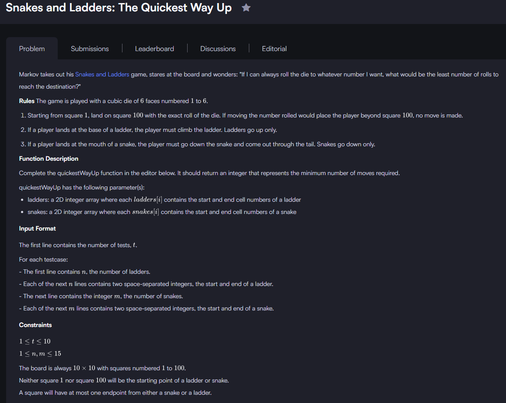
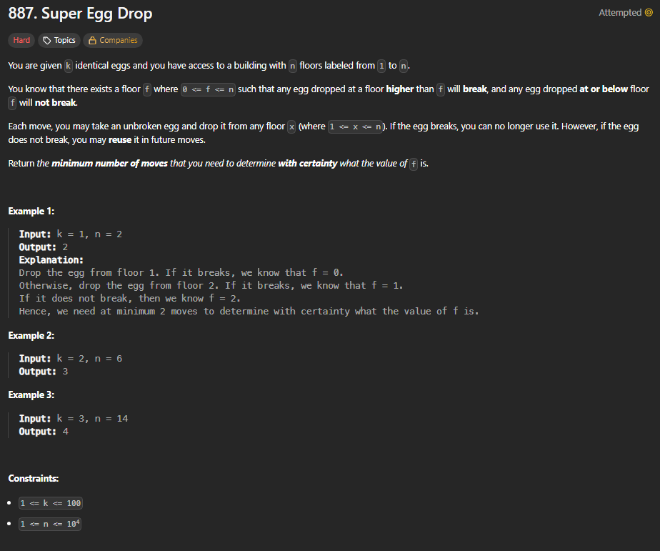
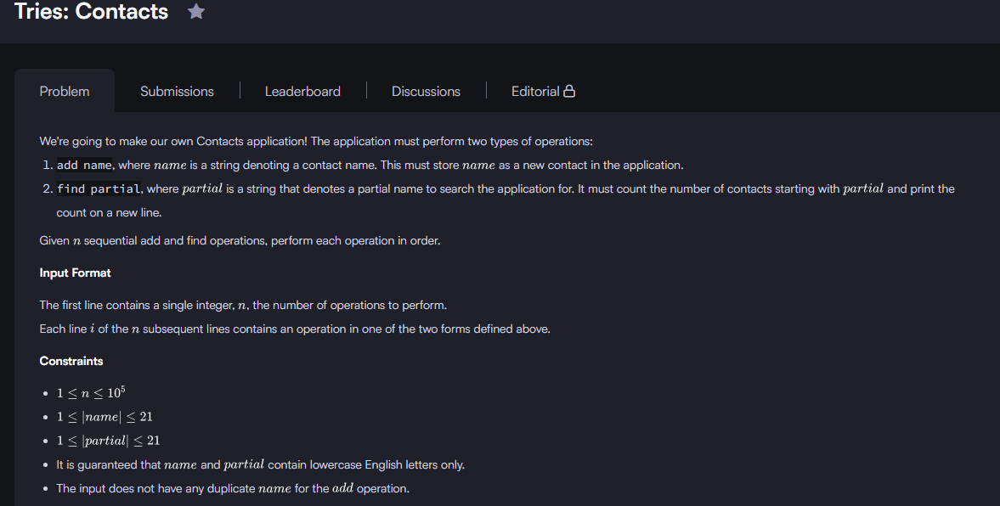
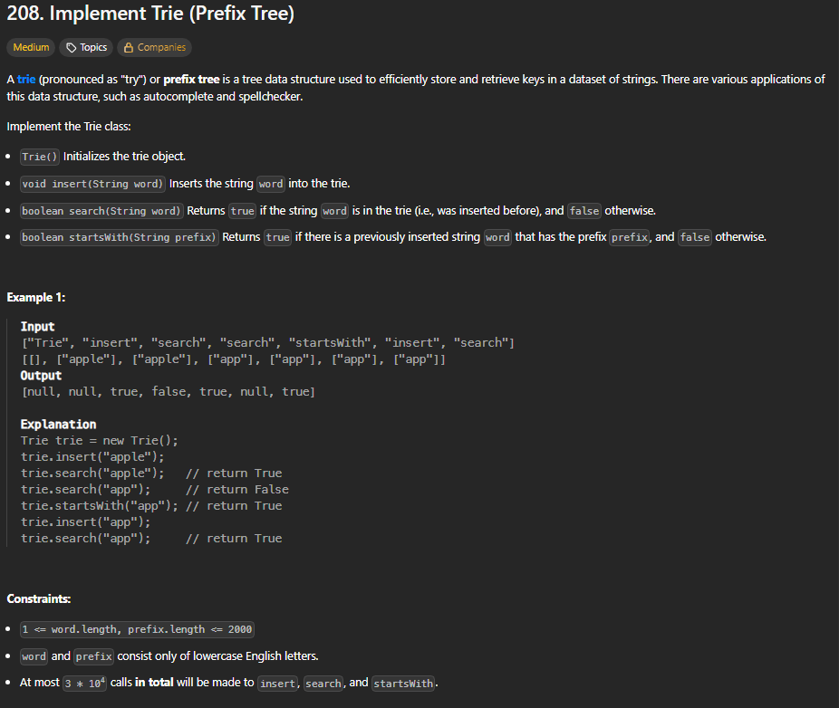

# INFORME DEL TRABAJO FINAL - FUNDAMENTOS DE PROGRAMACIÓN COMPETITIVA (CC217)

**Carrera de Ciencias de la Computación**  
**Sección:** 271  

**Alumnos:**  
- Mendoza Quispe Carlos Fabian (U20231C416)  
- Moncada Olivares Elias David  
- Medina Oropeza Enzo Daniel  

**Julio 2025**

---

## 1. Introducción

El presente informe documenta el desarrollo del trabajo final del curso **Fundamentos de Programación Competitiva – CC217**, el cual tiene como propósito aplicar conocimientos algorítmicos y estructuras de datos en la resolución de problemas de alta complejidad mediante lenguajes de programación como C++. En un contexto académico, este tipo de entrenamiento fortalece la capacidad de los estudiantes para analizar, diseñar, implementar y evaluar soluciones computacionales eficientes, especialmente en escenarios competitivos o de resolución técnica de problemas reales.

El objetivo del trabajo es aplicar técnicas de programación como búsqueda en anchura (BFS), programación dinámica, y estructuras de datos avanzadas (como Trie y Fenwick Tree) para resolver problemas propuestos en plataformas reconocidas como HackerRank y LeetCode. Estas plataformas simulan entornos exigentes y representan estándares internacionales en competencias de codificación.

El método empleado consiste en seleccionar un conjunto representativo de ejercicios de dificultad creciente, analizar sus requerimientos computacionales, diseñar la solución lógica y programarla en lenguaje C++, verificando su correcta ejecución a través de pruebas proporcionadas por las plataformas.

Como conclusión preliminar, se destaca el fortalecimiento de habilidades clave como el pensamiento lógico, la eficiencia algorítmica y la claridad en el diseño e implementación de soluciones. Además, se logra una alineación directa con el *student outcome 2* de ABET, que requiere diseñar, implementar y evaluar soluciones computacionales en el contexto de sistemas de información.

---

## 2. Objetivo del estudiante

---
## 3. Plan de actividades

| Nombre completo                  | Tareas realizadas                                                                                  | Autoevaluación (%) |
|----------------------------------|------------------------------------------------------------------------------------------------------|----------------------|
| Carlos Fabian Mendoza Quispe    | Desarrallo de algoritmos (Programación Dinamica, Árbol Fenwick,Trie), validación de pruebas y  organización del repositorio          | 35%                    |
| Elias David Moncada Olivares    |                      |                     |
| Enzo Daniel Medina Oropeza      |                |                   |

## 4. Desarrollo

### Ejercicio 1

### Ejercicio 2

### Ejercicio 3

### Ejercicio 4

