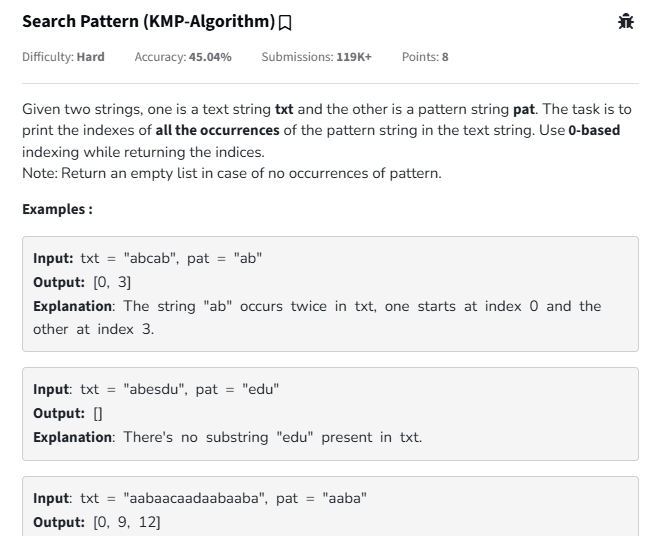

# INFORME DEL TRABAJO FINAL - FUNDAMENTOS DE PROGRAMACIÓN COMPETITIVA (CC217)

**Carrera de Ciencias de la Computación**  
**Sección:** 271  

**Alumnos:**  
- Mendoza Quispe Carlos Fabian (U20231C416)  
- Moncada Olivares Elias David (U202315959)
- Medina Oropeza Enzo Daniel  (U202220177)

**Julio 2025**

---

## 1. Introducción

El presente informe documenta el desarrollo del trabajo final del curso **Fundamentos de Programación Competitiva – CC217**, el cual tiene como propósito aplicar conocimientos algorítmicos y estructuras de datos en la resolución de problemas de alta complejidad mediante lenguajes de programación como C++. En un contexto académico, este tipo de entrenamiento fortalece la capacidad de los estudiantes para analizar, diseñar, implementar y evaluar soluciones computacionales eficientes, especialmente en escenarios competitivos o de resolución técnica de problemas reales.

El objetivo del trabajo es aplicar técnicas de programación como búsqueda en anchura (BFS), programación dinámica, y estructuras de datos avanzadas (como Trie y Fenwick Tree) para resolver problemas propuestos en plataformas reconocidas como HackerRank y LeetCode. Estas plataformas simulan entornos exigentes y representan estándares internacionales en competencias de codificación.

El método empleado consiste en seleccionar un conjunto representativo de ejercicios de dificultad creciente, analizar sus requerimientos computacionales, diseñar la solución lógica y programarla en lenguaje C++, verificando su correcta ejecución a través de pruebas proporcionadas por las plataformas.

Como conclusión preliminar, se destaca el fortalecimiento de habilidades clave como el pensamiento lógico, la eficiencia algorítmica y la claridad en el diseño e implementación de soluciones. Además, se logra una alineación directa con el *student outcome 2* de ABET, que requiere diseñar, implementar y evaluar soluciones computacionales en el contexto de sistemas de información.

---

## 2. Objetivo del estudiante

---
## 3. Plan de actividades

| Nombre completo                  | Tareas realizadas                                                                                  | Autoevaluación (%) |
|----------------------------------|------------------------------------------------------------------------------------------------------|----------------------|
| Carlos Fabian Mendoza Quispe    | Desarrollo de algoritmos (Programación Dinamica, Árbol Fenwick,Trie), validación de pruebas y  organización del repositorio          | 35%                    |
| Elias David Moncada Olivares    | Desarrollo de algoritmos (Algoritmo-Z y Map), validación de pruebas y organización del repositorio                   | 35%                    |
| Enzo Daniel Medina Oropeza      | Desarrollo de algoritmos (Algoritmo-KMP, Árbol de Segmentos y Árbol Ternario), validación de pruebas y organización del repositorio               | 35%                  |

## 4. Desarrollo

### Ejercicio 1


## 🐍 Snakes and Ladders (Programación Dinámica)

El problema pertenece a la categoría de algoritmos de búsqueda y se resuelve eficientemente mediante el algoritmo de Búsqueda en Anchura (BFS). Esta técnica permite encontrar el número mínimo de pasos necesarios para ir de un punto de inicio a un punto final en un grafo no ponderado, siendo ideal cuando se busca la menor cantidad de movimientos entre nodos.

Este desafío se encuentra en la plataforma de programación competitiva HackerRank, la cual permite resolver problemas prácticos de estructuras de datos, algoritmos, matemáticas, inteligencia artificial, entre otros. En este caso, el problema forma parte de la sección de grafos.

El enlace directo al enunciado del problema en HackerRank es el siguiente:

🔗 [Snakes and Ladders](https://www.hackerrank.com/challenges/the-quickest-way-up/problem)


El problema plantea una simulación del clásico juego de mesa “Serpientes y Escaleras”. El jugador comienza en la casilla 1 y debe llegar a la casilla 100 lanzando un dado, cuyo resultado puede ser cualquier número del 1 al 6. Si cae en una casilla donde hay una escalera, sube automáticamente hasta el extremo superior de esta; si cae en una serpiente, desciende hasta el extremo inferior. El objetivo es encontrar la mínima cantidad de lanzamientos de dado necesarios para alcanzar la casilla 100, considerando todas las escaleras y serpientes presentes en el tablero. Pueden existir múltiples escenarios (casos de prueba), cada uno con diferentes configuraciones de escaleras y serpientes.

La solución implementada en lenguaje C + + utiliza un vector para simular el tablero y una cola para realizar la búsqueda en anchura. Cada casilla del tablero es tratada como un nodo y cada posible lanzamiento del dado (de 1 a 6) es una arista hacia otro nodo. Se marcan las casillas ya visitadas para evitar ciclos, y se simula el avance del jugador tomando en cuenta los cambios de posición provocados por escaleras o serpientes.

A continuación, se presenta el código completo del algoritmo desarrollado en C++:

## 📊 C++ Snakes and Ladders Solver

```cpp
#include <iostream>
#include <vector>
#include <queue>
using namespace std;

int quickestWayUp(const vector<pair<int, int>>& ladders, const vector<pair<int, int>>& snakes) {
    vector<int> board(101);
    for (int i = 1; i <= 100; ++i)
        board[i] = i;

    for (const auto& ladder : ladders)
        board[ladder.first] = ladder.second;

    for (const auto& snake : snakes)
        board[snake.first] = snake.second;

    vector<bool> visited(101, false);
    queue<pair<int, int>> q;
    q.push({1, 0});
    visited[1] = true;

    while (!q.empty()) {
        int pos = q.front().first;
        int moves = q.front().second;
        q.pop();

        if (pos == 100)
            return moves;

        for (int dice = 1; dice <= 6; ++dice) {
            int next = pos + dice;
            if (next <= 100 && !visited[board[next]]) {
                visited[board[next]] = true;
                q.push({board[next], moves + 1});
            }
        }
    }

    return -1;
}

int main() {
    int t;
    cin >> t;
    vector<int> resultados;

    while (t--) {
        int n;
        cin >> n;
        vector<pair<int, int>> ladders(n);
        for (int i = 0; i < n; ++i)
            cin >> ladders[i].first >> ladders[i].second;

        int m;
        cin >> m;
        vector<pair<int, int>> snakes(m);
        for (int i = 0; i < m; ++i)
            cin >> snakes[i].first >> snakes[i].second;

        resultados.push_back(quickestWayUp(ladders, snakes));
    }

    for (int res : resultados)
        cout << res << endl;

    return 0;
}
```
### 📥 Ingreso y Salida de Datos

Respecto al ingreso y salida de datos, el programa comienza solicitando un número entero que representa la cantidad de casos de prueba. Para cada caso, se ingresan las escaleras disponibles, luego las serpientes, y finalmente se imprime el mínimo número de movimientos requerido para completar el juego.

A modo de ejemplo, si se ingresan los siguientes datos:

```
2
3
32 62
42 68
12 98
7
95 13
97 25
93 37
79 27
75 19
49 47
67 17
4
8 52
6 80
26 42
2 72
9
51 19
39 11
37 29
81 3
59 5
79 23
53 7
43 33
77 21
```

La salida del programa será:

```
3
5
```

Esto significa que en el primer escenario se necesitan **3 lanzamientos de dado** para alcanzar la casilla 100, y en el segundo, **5 lanzamientos**.

### 📈 Funcionamiento del Algoritmo

En cuanto a la verificación del algoritmo, se garantiza encontrar el camino más corto desde la casilla 1 hasta la 100. Cada nivel de la búsqueda representa una cantidad adicional de lanzamientos. Si una casilla contiene una escalera o serpiente, se redirecciona automáticamente al destino de esta, modelando correctamente el comportamiento del tablero.

Esta solución es robusta y eficiente, y asegura que, si existe un camino para llegar a la casilla final, se encontrará con el menor número posible de movimientos.


### Ejercicio 2


## 🥚 Super Egg Drop (Programación Dinámica)

El problema “Super Egg Drop” pertenece a la categoría de algoritmos de programación dinámica avanzada. Se trata de un clásico ejemplo de optimización con subproblemas solapados, en el que se requiere determinar el número mínimo de movimientos necesarios para resolver un escenario incierto en el peor de los casos. El algoritmo que se aplica aquí es una forma eficiente de programación dinámica (DP) con un enfoque de diseño basado en la estrategia minimax, la cual busca minimizar el número máximo de intentos requeridos en el peor escenario.

Este desafío está disponible en la plataforma LeetCode, una reconocida herramienta web para la práctica de algoritmos y estructuras de datos, ampliamente utilizada en entrevistas técnicas por empresas tecnológicas.


El enlace directo al enunciado del problema en LeetCode es el siguiente:

🔗 [Super Egg Drop](https://leetcode.com/problems/super-egg-drop/)

El enunciado plantea el siguiente reto: se cuenta con k huevos idénticos y un edificio de n pisos, numerados del 1 al n. Existe un piso crítico f tal que, si se lanza un huevo desde cualquier piso superior a f, este se romperá, mientras que si se lanza desde f o cualquier piso inferior, no se romperá. El objetivo es encontrar con certeza el valor de f utilizando la menor cantidad de lanzamientos posibles, considerando que si un huevo se rompe ya no puede volver a usarse, pero si sobrevive, puede ser reutilizado.

A continuación, se presenta el código completo del algoritmo desarrollado en C++:

## 📊 C++ Super Egg Drop 

```cpp
#include <vector>
#include <algorithm>
using namespace std;

class Solution {
public:
    vector<vector<int>> memo;

    int dp(int k, int n) {
        if (n == 0 || n == 1) return n;
        if (k == 1) return n;
        if (memo[k][n] != -1) return memo[k][n];

        int low = 1, high = n;
        int res = n;

        while (low <= high) {
            int mid = (low + high) / 2;
            int broken = dp(k - 1, mid - 1);
            int notBroken = dp(k, n - mid);
            int worst = max(broken, notBroken) + 1;

            res = min(res, worst);

            if (broken > notBroken) {
                high = mid - 1;
            } else {
                low = mid + 1;
            }
        }

        return memo[k][n] = res;
    }

    int superEggDrop(int k, int n) {
        memo = vector<vector<int>>(k + 1, vector<int>(n + 1, -1));
        return dp(k, n);
    }
};
```

### 📥 Ingreso y Salida de Datos

Respecto al ingreso y salida de datos, el programa recibe como parámetros los valores de **k** (cantidad de huevos) y **n** (cantidad de pisos). La función `superEggDrop(k, n)` devolverá como resultado el número mínimo de lanzamientos necesarios en el peor de los casos para determinar con certeza el piso crítico.

A modo de ejemplo, si se ingresan los siguientes datos:

```cpp
k = 2
n = 6
```

La salida del programa será:

```
3
```

Esto significa que se requieren **al menos 3 lanzamientos** en el peor escenario para determinar con certeza el piso crítico donde los huevos empiezan a romperse.

### 📈 Funcionamiento del Algoritmo

En cuanto a la verificación del algoritmo, se garantiza encontrar el número mínimo de intentos para determinar el piso crítico. La solución implementa una **Programación Dinámica con memoización** para evitar cálculos redundantes de subproblemas y una búsqueda binaria dentro del rango de pisos posibles para optimizar la cantidad de simulaciones.

Cada llamada recursiva simula dos posibles escenarios:

- **Que el huevo se rompa** (y se reduce la cantidad de huevos disponibles y el rango de pisos).
- **Que el huevo no se rompa** (se mantiene la cantidad de huevos, pero se reduce el rango de pisos restantes).

Luego, se toma el peor de los dos casos posibles (ya que el escenario a resolver debe funcionar incluso en el peor de los casos) y se le suma un intento por el lanzamiento actual. Se busca minimizar este valor máximo para obtener la solución más eficiente.


### Ejercicio 3


## 📖 Contacts (Trie) 

El problema **“Tries: Contacts”** es un ejercicio de dificultad **Hard** de la plataforma **HackerRank**, el cual plantea la implementación de una agenda de contactos capaz de realizar dos operaciones: **agregar un nombre** y **encontrar cuántos nombres comienzan con un prefijo dado**. Dado que el número de operaciones puede alcanzar hasta **100.000**, se requiere una solución con alta eficiencia en tiempo.

Este problema se resuelve utilizando un algoritmo basado en la estructura de datos **Trie**, también conocida como **árbol de prefijos**. Un Trie permite almacenar múltiples cadenas de texto aprovechando sus prefijos compartidos, lo que reduce la redundancia y mejora el tiempo de búsqueda. Las operaciones básicas en un Trie (inserción y búsqueda por prefijo) se realizan en tiempo lineal respecto a la longitud de la palabra o prefijo, es decir, en **O(L)**, donde **L** es la cantidad de letras.

El problema se encuentra publicado en la plataforma **HackerRank** en el siguiente enlace:

🔗 [ Contacts](https://www.hackerrank.com/challenges/ctci-contacts/problem)

El enunciado solicita procesar operaciones. Cada operación puede ser de tipo `add name`, que agrega un nuevo nombre a la estructura, o `find partial`, que devuelve cuántos nombres actualmente almacenados comienzan con el prefijo `partial`. Las palabras están compuestas por letras minúsculas sin espacios, y los nombres no se repiten. El objetivo es responder a todas las operaciones `find` de manera eficiente y precisa.

A continuación, se muestra el código completo desarrollado en **C++**:

## 📊 C++ Contacts (Trie) 

```cpp
#include <iostream>
#include <string>
#include <vector>
using namespace std;

struct TrieNode {
    TrieNode* children[26];
    int prefixCount;

    TrieNode() {
        for (int i = 0; i < 26; ++i)
            children[i] = nullptr;
        prefixCount = 0;
    }
};

class ContactsTrie {
private:
    TrieNode* root;

public:
    ContactsTrie() {
        root = new TrieNode();
    }

    void add(const string& name) {
        TrieNode* node = root;
        for (char c : name) {
            int idx = c - 'a';
            if (!node->children[idx])
                node->children[idx] = new TrieNode();
            node = node->children[idx];
            node->prefixCount++;
        }
    }

    int find(const string& partial) {
        TrieNode* node = root;
        for (char c : partial) {
            int idx = c - 'a';
            if (!node->children[idx])
                return 0;
            node = node->children[idx];
        }
        return node->prefixCount;
    }
};

int main() {
    int n;
    cin >> n;

    ContactsTrie trie;
    vector<int> resultados;
    string command, value;

    for (int i = 0; i < n; ++i) {
        cin >> command >> value;
        if (command == "add") {
            trie.add(value);
        } else if (command == "find") {
            resultados.push_back(trie.find(value));
        }
    }

    for (int res : resultados) {
        cout << res << endl;
    }

    return 0;
}
```

### 📥 Ingreso y Salida de Datos

Por ejemplo, si se ingresan las siguientes operaciones:

```
4
add hack
add hackerrank
find hac
find hak
```

La salida será:

```
2
0
```

Esto indica que existen **2 nombres** en la agenda que comienzan con `hac` y **ninguno** que comience con `hak`.

### 📈 Funcionamiento del Algoritmo

El algoritmo aprovecha la estructura de datos **Trie** para almacenar los nombres de forma eficiente, compartiendo los prefijos comunes entre ellos. Cada vez que se añade una letra, se incrementa un contador en el nodo correspondiente, lo que permite, al buscar un prefijo, conocer en tiempo constante cuántos nombres comienzan con ese prefijo siguiendo los nodos del árbol.

Esto permite procesar una gran cantidad de operaciones de forma eficiente, incluso cuando el número de nombres y consultas es alto.


### Ejercicio 4


## 📖 Implement Trie (Prefix Tree)

El problema “Implement Trie (Prefix Tree)” es un ejercicio de dificultad Medium de la plataforma LeetCode, el cual plantea la implementación de una estructura de datos eficiente capaz de almacenar palabras y realizar búsquedas completas o por prefijo. Esta estructura es útil en aplicaciones como autocompletado, correctores ortográficos y motores de búsqueda.

Este problema se resuelve utilizando un algoritmo basado en la estructura de datos Trie, también conocida como árbol de prefijos. Un Trie permite almacenar múltiples cadenas de texto aprovechando sus prefijos compartidos, lo que reduce la redundancia y mejora el tiempo de búsqueda. Las operaciones básicas en un Trie (inserción, búsqueda exacta y búsqueda por prefijo) se realizan en tiempo lineal respecto a la longitud de la palabra, es decir, en O(L), donde L es el número de letras.

El problema se encuentra publicado en la plataforma LeetCode en el siguiente enlace:

🔗 [Implement Trie](https://leetcode.com/problems/implement-trie-prefix-tree/)

El enunciado solicita implementar una clase llamada Trie con tres operaciones fundamentales:

- `insert word`: agrega una nueva palabra a la estructura.
- `search word`: verifica si una palabra exacta está almacenada en el trie.
- `startsWith prefix`: determina si alguna palabra almacenada comienza con el prefijo especificado.

## 📊 C++ Trie Prefix Tree 

A continuación, se muestra el código en C++:

```cpp
#include <iostream>
#include <string>
using namespace std;

class TrieNode {
public:
    TrieNode* children[26]; 
    bool isEndOfWord;

    TrieNode() {
        isEndOfWord = false;
        for(int i = 0; i < 26; i++)
            children[i] = nullptr;
    }
};

class Trie {
private:
    TrieNode* root;

public:
    Trie() {
        root = new TrieNode();
    }

    void insert(string word) {
        TrieNode* node = root;
        for(char c : word) {
            int index = c - 'a';
            if(!node->children[index])
                node->children[index] = new TrieNode();
            node = node->children[index];
        }
        node->isEndOfWord = true;
    }

    bool search(string word) {
        TrieNode* node = root;
        for(char c : word) {
            int index = c - 'a';
            if(!node->children[index])
                return false;
            node = node->children[index];
        }
        return node->isEndOfWord;
    }

    bool startsWith(string prefix) {
        TrieNode* node = root;
        for(char c : prefix) {
            int index = c - 'a';
            if(!node->children[index])
                return false;
            node = node->children[index];
        }
        return true;
    }
};
```

### 📥 Ingreso y Salida de Datos

Respecto al ingreso y salida de datos, el programa permite insertar palabras al Trie, buscar si una palabra exacta existe en la estructura, y verificar si alguna palabra almacenada comienza con un prefijo determinado. Las operaciones se realizan de forma secuencial llamando a los métodos correspondientes de la clase `Trie`.

Por ejemplo, si se ejecutan las siguientes instrucciones:

```cpp
trie.insert("apple");
cout << trie.search("apple") << endl;    
cout << trie.search("app") << endl;     
cout << trie.startsWith("app") << endl;  
trie.insert("app");
cout << trie.search("app") << endl;   
```

La salida será:

```
[null, null, true, false, true, null, true]
```

Esto significa que:

- Se insertó correctamente la palabra `"apple"`.
- La búsqueda exacta de `"apple"` devolvió `true`.
- La búsqueda exacta de `"app"` devolvió `false` inicialmente.
- La verificación de prefijo `"app"` devolvió `true`, porque `"apple"` comienza con `"app"`.
- Tras insertar `"app"` y buscarla nuevamente, devolvió `true`.


### Ejercicio 5  


## 🔄 Swapping Numbers (Fenwick Tree)

El problema **“Swapping Numbers”** es un ejercicio de dificultad **media**, el cual plantea la optimización del número mínimo de intercambios adyacentes (inversiones) necesarios para ordenar una permutación, permitiendo realizar como máximo un solo intercambio entre cualquier par de posiciones (no necesariamente adyacentes).

Este problema se resuelve utilizando un algoritmo basado en el conteo eficiente de inversiones, lo cual puede lograrse mediante una estructura de datos llamada **Fenwick Tree** (también conocido como **Binary Indexed Tree**). Este árbol permite contar, en tiempo logarítmico, cuántos elementos menores han aparecido antes o después de una posición, lo cual es clave para calcular el número de inversiones.

El problema se encuentra publicado en la plataforma **HackerEarth** en el siguiente enlace:  
🔗 [Swapping Numbers](https://www.hackerearth.com/practice/data-structures/advanced-data-structures/fenwick-binary-indexed-trees/practice-problems/algorithm/move-minimization-8a9d3991/)

Dada una permutación de tamaño **n**, se debe calcular la cantidad mínima de **swaps adyacentes** necesarios para ordenarla en orden creciente, permitiendo realizar como máximo **un solo swap libre** entre cualquier par de posiciones del arreglo.

Un swap adyacente es una inversión: un par de índices _(i, j)_ donde _i < j_ y _A[i] > A[j]_.

A continuación, se muestra el código en C++:

## 📊 C++ Swapping Numbers (Fenwick Tree)

```cpp
#include <cstdlib>
#include <iostream>
#include <iomanip>
#include <vector>
#include <algorithm>
using namespace std;

const int MAX = 7005;
vector<int> fw(MAX);

int getSum(int i) {
    int res = 0;
    while (i > 0) {
        res += fw[i];
        i -= i & -i;
    }
    return res;
}

void updateFW(int i, int val) {
    while (i < MAX) {
        fw[i] += val;
        i += i & -i;
    }
}

int countInversions(const vector<int>& a) {
    int n = a.size();
    fill(fw.begin(), fw.end(), 0); 
    int inv = 0;
    for (int i = n - 1; i >= 0; --i) {
        inv += getSum(a[i] - 1);
        updateFW(a[i], 1);
    }
    return inv;
}

int main() {
    int n;
    cin >> n;

    vector<int> a(n);
    for (int i = 0; i < n; ++i)
        cin >> a[i];

    int minBeauty = countInversions(a); 

    for (int i = 0; i < n; ++i) {
        for (int j = i + 1; j < n; ++j) {
            swap(a[i], a[j]);
            int inv = countInversions(a);
            minBeauty = min(minBeauty, inv);
            swap(a[i], a[j]); 
        }
    }

    cout << minBeauty << '\n';
    return 0;
}
```

### 📥 Ingreso y Salida de Datos


Respecto al ingreso y salida de datos, el programa lee primero un entero n, que indica el tamaño de la permutación, y a continuación n enteros que representan la secuencia. Tras procesar la permutación contando inversiones y evaluando un único swap libre, imprime un único entero: la mínima cantidad de swaps adyacentes necesarios.

Por ejemplo, si la entrada es:

```cpp
5
1 4 2 3 5
```

La salida será:

```
1
```


### Ejercicio 6  


## 🌳 Beautiful Pair of Nodes (Fenwick Tree 2D + DFS)

Se da un árbol con un nodo raíz y cada vértice del árbol está etiquetado con dos valores enteros, uno designado como A y otro como B. El objetivo es contar todos los pares de nodos tales que el primero de ellos sea ancestro del segundo en el árbol y, al mismo tiempo, sus valores A y sus valores B sean estrictamente menores que los correspondientes del nodo descendiente. La entrada especifica primero el número de vértices, luego las conexiones entre ellos que forman el árbol, y después dos listas de valores, una para las etiquetas A y otra para las etiquetas B. La salida debe ser un único entero: la cantidad total de pares que cumplen ambas condiciones.

Para poder responder a cuántos ancestros cumplen las dos condiciones de comparación, primero se transforma cada lista de valores en un rango compacto de enteros consecutivos (compresión de coordenadas). A continuación se construye un Fenwick Tree bidimensional sobre esos rangos: la primera dimensión corresponde a los valores de A y dentro de cada posición se mantiene otro Fenwick Tree que gestiona los valores de B.

Al recorrer el árbol mediante búsqueda en profundidad, se va añadiendo al Fenwick Tree la información de cada nodo antes de procesar a sus hijos y se retira cuando se regresa en el recorrido. Justo antes de insertar el nodo actual, se realiza una consulta para contar cuántos de sus ancestros ya insertados cumplen que sus valores comprimidos de A y B son menores que los del nodo en cuestión. De este modo, cada vez que se visita un nuevo vértice se obtiene el número de pares válidos en los que participa como segundo elemento, y al final la suma acumulada es la respuesta buscada.

El problema se encuentra publicado en la plataforma **HackerEarth** en el siguiente enlace:  

🔗 [Beautiful Pair of Nodes ](https://www.hackerearth.com/practice/data-structures/advanced-data-structures/fenwick-binary-indexed-trees/practice-problems/algorithm/beautiful-pair-of-nodes-d5dea13c/)

A continuación, se muestra el código en C++:

## 📊 C++  Beautiful Pair of Nodes (Fenwick Tree)

```cpp
#include <cstdio>
#include <vector>
#include <algorithm>

using namespace std;
using ll = long long;

int n, NA;
vector<vector<int>> adj;
vector<int> A, B, ca, cb;
vector<vector<int>> bitY, fenw;
ll ans = 0;

void update(int a, int b, int v) {
    for (int i = a; i <= NA; i += i & -i) {
        int idx = int(lower_bound(bitY[i].begin(), bitY[i].end(), b)
                    - bitY[i].begin()) + 1;
        for (int j = idx; j < (int)fenw[i].size(); j += j & -j)
            fenw[i][j] += v;
    }
}

int query(int a, int b) {
    int s = 0;
    for (int i = a; i > 0; i -= i & -i) {
        int idx = int(upper_bound(bitY[i].begin(), bitY[i].end(), b)
                    - bitY[i].begin());
        for (int j = idx; j > 0; j -= j & -j)
            s += fenw[i][j];
    }
    return s;
}

void dfs(int u, int p) {
    ans += query(ca[u] - 1, cb[u] - 1);
    update(ca[u], cb[u], +1);
    for (int v : adj[u]) if (v != p) dfs(v, u);
    update(ca[u], cb[u], -1);
}

int main(){
    scanf("%d", &n);
    adj.assign(n+1, vector<int>());
    for (int i = 0; i < n-1; i++) {
        int u, v;
        scanf("%d %d", &u, &v);
        adj[u].push_back(v);
        adj[v].push_back(u);
    }
    A.resize(n+1); B.resize(n+1);
    for (int i = 1; i <= n; i++) scanf("%d", &A[i]);
    for (int i = 1; i <= n; i++) scanf("%d", &B[i]);

    { vector<int> tmp(A.begin()+1, A.end());
      sort(tmp.begin(), tmp.end());
      tmp.erase(unique(tmp.begin(), tmp.end()), tmp.end());
      NA = tmp.size();
      ca.resize(n+1);
      for (int i = 1; i <= n; i++)
        ca[i] = int(lower_bound(tmp.begin(), tmp.end(), A[i]) - tmp.begin()) + 1;
    }
    { vector<int> tmp(B.begin()+1, B.end());
      sort(tmp.begin(), tmp.end());
      tmp.erase(unique(tmp.begin(), tmp.end()), tmp.end());
      cb.resize(n+1);
      for (int i = 1; i <= n; i++)
        cb[i] = int(lower_bound(tmp.begin(), tmp.end(), B[i]) - tmp.begin()) + 1;
    }

    bitY.assign(NA+1, vector<int>());
    for (int u = 1; u <= n; u++) {
        for (int i = ca[u]; i <= NA; i += i & -i)
            bitY[i].push_back(cb[u]);
    }
    fenw.assign(NA+1, vector<int>());
    for (int i = 1; i <= NA; i++) {
        auto &v = bitY[i];
        sort(v.begin(), v.end());
        v.erase(unique(v.begin(), v.end()), v.end());
        fenw[i].assign(v.size()+1, 0);
    }

    dfs(1, 0);
    printf("%lld\n", ans);
    return 0;
}
```
### 📥 Ingreso y Salida de Datos

El programa primero lee el número de vértices. A continuación recibe las conexiones que forman el árbol y luego dos listas de valores, una para las etiquetas A y otra para las etiquetas B. Finalmente muestra un solo número que indica la cantidad total de pares que cumplen ambas condiciones de ancestro y comparación de valores.

Por ejemplo, si la entrada es:

```cpp
7
1 2
1 3
2 4
2 5
3 6
3 7
4 9 1 2 2 6 9
3 4 4 5 9 3 8
```

La salida será:

```
3
```


### Ejercicio 7 (Algoritmo KMP1)


### Search pattern

El problema “Search Pattern” es un ejercicio de dificultad Hard, que plantea la búsqueda de todas las ocurrencias de un patrón dentro de un texto dado. Ambos están compuestos únicamente por letras minúsculas y pueden tener una longitud considerable, llegando hasta el millón de caracteres. Por lo tanto, se requiere una solución con una eficiencia óptima en tiempo.

Este problema se resuelve utilizando el algoritmo Knuth-Morris-Pratt (KMP), un algoritmo clásico de búsqueda de patrones que mejora significativamente el tiempo de ejecución frente a enfoques ingenuos. Mientras que la búsqueda directa tiene una complejidad de tiempo O(n⋅m), donde “n” es la longitud del texto y “m”, la del patrón, KMP reduce esta complejidad a O(n+m) gracias a un preprocesamiento inteligente del patrón.

El problema se encuentra publicado en la plataforma de Geekforgeeks en el siguiente enlace:
https://www.geeksforgeeks.org/problems/search-pattern0205/1

A continuación, se muestra el código en C++:

### KMP Algorithm

```cpp
#include <vector>
#include <string>
using namespace std;

class Solution {
public:
    vector<int> computeLPSArray(string pat) {
        int m = pat.length();
        vector<int> lps(m, 0);
        int len = 0;
        int i = 1;
        while (i < m) {
            if (pat[i] == pat[len]) {
                len++;
                lps[i] = len;
                i++;
            } else {
                if (len != 0) {
                    len = lps[len - 1];
                } else {
                    lps[i] = 0;
                    i++;
                }
            }
        }
        return lps;
    }

    vector<int> search(string pat, string txt) {
        vector<int> lps = computeLPSArray(pat);
        vector<int> result;
        int i = 0, j = 0;
        int n = txt.length(), m = pat.length();
        while (i < n) {
            if (pat[j] == txt[i]) {
                i++;
                j++;
            }

            if (j == m) {
                result.push_back(i - j);
                j = lps[j - 1];
            } else if (i < n && pat[j] != txt[i]) {
                if (j != 0)
                    j = lps[j - 1];
                else
                    i++;
            }
        }
        return result;
    }
};
```

### Resultados:


### Ejercicio 8 (Algoritmo KMP2)


### Longest Happy Prefix

El problema “Longest Happy Prefix” es un ejercicio de dificultad Hard, el cual consiste en encontrar el prefijo más largo de una cadena que también sea sufijo, excluyendo la cadena completa. Es decir, se busca el mayor prefijo no vacío que coincida exactamente con un sufijo de la misma cadena. Este tipo de problema tiene aplicaciones en algoritmos de búsqueda de patrones y análisis de cadenas.

Dado que la longitud de la cadena puede alcanzar hasta 100.000 caracteres, se requiere una solución eficiente con tiempo lineal. Esto descarta enfoques ingenuos basados en comparar manualmente todos los prefijos y sufijos posibles, ya que tendrían un rendimiento inaceptable para cadenas largas.

El problema se encuentra publicado en la plataforma de Leetcode en el siguiente enlace:
https://leetcode.com/problems/longest-happy-prefix/description/

A continuación, se muestra el código en C++:

### KMP Algorithm

```cpp
class Solution {
public:
    struct SegmentTree {
        int n;
        vector<int> tree;

        SegmentTree(const vector<int>& baskets) {
            n = baskets.size();
            tree.resize(4 * n);
            build(1, 0, n - 1, baskets);
        }

        void build(int node, int l, int r, const vector<int>& baskets) {
            if (l == r) {
                tree[node] = baskets[l];
            } else {
                int mid = (l + r) / 2;
                build(2 * node, l, mid, baskets);
                build(2 * node + 1, mid + 1, r, baskets);
                tree[node] = max(tree[2 * node], tree[2 * node + 1]);
            }
        }

        int query(int node, int l, int r, int fruitQty) {
            if (tree[node] < fruitQty) return -1;
            if (l == r) return l;

            int mid = (l + r) / 2;
            if (tree[2 * node] >= fruitQty)
                return query(2 * node, l, mid, fruitQty);
            else
                return query(2 * node + 1, mid + 1, r, fruitQty);
        }

        void update(int node, int l, int r, int idx, int value) {
            if (l == r) {
                tree[node] = value;
            } else {
                int mid = (l + r) / 2;
                if (idx <= mid)
                    update(2 * node, l, mid, idx, value);
                else
                    update(2 * node + 1, mid + 1, r, idx, value);
                tree[node] = max(tree[2 * node], tree[2 * node + 1]);
            }
        }

        int findAndUse(int fruitQty) {
            int idx = query(1, 0, n - 1, fruitQty);
            if (idx != -1)
                update(1, 0, n - 1, idx, -1);
            return idx;
        }
    };

    int numOfUnplacedFruits(vector<int>& fruits, vector<int>& baskets) {
        SegmentTree seg(baskets);
        int unplaced = 0;

        for (int fruit : fruits) {
            if (seg.findAndUse(fruit) == -1)
                unplaced++;
        }

        return unplaced;
    }
};
```

### Resultados:


### Ejercicio 9 (Árbol de Segmentos1)


### Range Minimum Query

El problema “Range Minimum Query” es un ejercicio de dificultad media que se centra en la construcción y uso de la estructura de datos eficiente conocida como Segment Tree. Esta estructura es especialmente útil cuando se requiere responder rápidamente a consultas sobre rangos de un arreglo, como obtener el mínimo valor en un subarreglo. El reto también implica actualizar el árbol de forma eficiente si fuera necesario, aunque en este caso solo se trabaja con consultas.

Este ejercicio presenta un arreglo de tamaño N y múltiples consultas del tipo "¿cuál es el valor mínimo entre los índices a y b?". Dado que puede haber hasta 10,000 consultas por caso de prueba, una solución ingenua con complejidad O(N) por consulta sería ineficiente. Por ello, se requiere una solución en tiempo logarítmico por consulta, que es donde entra en juego el Segment Tree.

El problema se encuentra publicado en la plataforma de Geekforgeeks en el siguiente enlace:
https://www.geeksforgeeks.org/problems/range-minimum-query/1

A continuación, se muestra el código en C++:

### Segment Tree

```cpp
#include <iostream>
#include <vector>
using namespace std;

// Función para construir el Segment Tree
void buildST(vector<int>& st, const vector<int>& A, int start, int end, int node) {
    if (start == end) {
        st[node] = A[start];
        return;
    }

    int mid = (start + end) / 2;
    buildST(st, A, start, mid, 2 * node + 1);
    buildST(st, A, mid + 1, end, 2 * node + 2);

    st[node] = (st[2 * node + 1] < st[2 * node + 2]) ? st[2 * node + 1] : st[2 * node + 2];
}

// Función constructora que devuelve el árbol segmentado
int* constructST(int A[], int N) {
    int h = 1;
    while ((1 << h) < N) h++;
    int size = 2 * (1 << h) - 1;

    vector<int>* stVec = new vector<int>(size);
    vector<int>& st = *stVec;

    vector<int> input(A, A + N);
    buildST(st, input, 0, N - 1, 0);
    
    return st.data(); // devuelve el puntero al primer elemento
}

// Función auxiliar para consultar el mínimo en el Segment Tree
int queryST(int st[], int si, int ss, int se, int qs, int qe) {
    // caso completamente fuera de rango
    if (se < qs || ss > qe)
        return 1000000001; // mayor que cualquier A[i]

    // caso completamente dentro del rango
    if (ss >= qs && se <= qe)
        return st[si];

    // caso parcialmente dentro del rango
    int mid = (ss + se) / 2;
    int leftMin = queryST(st, 2 * si + 1, ss, mid, qs, qe);
    int rightMin = queryST(st, 2 * si + 2, mid + 1, se, qs, qe);

    return (leftMin < rightMin) ? leftMin : rightMin;
}

// Función para RMQ
int RMQ(int st[], int N, int a, int b) {
    return queryST(st, 0, 0, N - 1, a, b);
}
```

### Resultados:


### Gráfico:


### Ejercicio 10 (Árbol de Segmentos2)


### Fruits and Baskets III

El problema “Fruits and Baskets III” es un ejercicio de dificultad media que plantea la asignación eficiente de elementos de un conjunto (frutas) a otro (canastas) bajo restricciones específicas. El objetivo es determinar cuántos tipos de frutas no pueden colocarse en ninguna canasta disponible, siguiendo un orden de asignación de izquierda a derecha.

Este problema puede resolverse de forma eficiente utilizando un Segment Tree (árbol de segmento), una estructura de datos que permite realizar consultas y actualizaciones en rangos de forma óptima, típicamente en tiempo O(log n).

El problema se encuentra publicado en la plataforma de Leetcode en el siguiente enlace:
https://leetcode.com/problems/fruits-into-baskets-iii/description/?envType=problem-list-v2&envId=segment-tree

A continuación, se muestra el código en C++:

### Segment Tree

```cpp
class Solution {
public:
    struct SegmentTree {
        int n;
        vector<int> tree;

        SegmentTree(const vector<int>& baskets) {
            n = baskets.size();
            tree.resize(4 * n);
            build(1, 0, n - 1, baskets);
        }

        void build(int node, int l, int r, const vector<int>& baskets) {
            if (l == r) {
                tree[node] = baskets[l];
            } else {
                int mid = (l + r) / 2;
                build(2 * node, l, mid, baskets);
                build(2 * node + 1, mid + 1, r, baskets);
                tree[node] = max(tree[2 * node], tree[2 * node + 1]);
            }
        }

        int query(int node, int l, int r, int fruitQty) {
            if (tree[node] < fruitQty) return -1;
            if (l == r) return l;

            int mid = (l + r) / 2;
            if (tree[2 * node] >= fruitQty)
                return query(2 * node, l, mid, fruitQty);
            else
                return query(2 * node + 1, mid + 1, r, fruitQty);
        }

        void update(int node, int l, int r, int idx, int value) {
            if (l == r) {
                tree[node] = value;
            } else {
                int mid = (l + r) / 2;
                if (idx <= mid)
                    update(2 * node, l, mid, idx, value);
                else
                    update(2 * node + 1, mid + 1, r, idx, value);
                tree[node] = max(tree[2 * node], tree[2 * node + 1]);
            }
        }

        int findAndUse(int fruitQty) {
            int idx = query(1, 0, n - 1, fruitQty);
            if (idx != -1)
                update(1, 0, n - 1, idx, -1);
            return idx;
        }
    };
```

### Resultados:


### Gráfico:


### Ejercicio 11 (Árbol Ternario)


### Is this Ternary Search?

El problema “Is this Ternary Search” es un ejercicio de dificultad Medium de la plataforma HackerRank que propone la construcción de un árbol de búsqueda ternario (Ternary Search Tree, TST), una estructura de datos poco común, pero interesante desde el punto de vista algorítmico. En este árbol, cada nodo puede tener hasta tres hijos: izquierdo, medio y derecho, y se asignan de acuerdo a comparaciones entre claves enteras.

El objetivo del problema es construir el árbol siguiendo las reglas específicas de inserción, e imprimir para cada nuevo valor insertado el valor de la clave del nodo padre que lo recibió como hijo.

El problema se encuentra publicado en la plataforma de Rankerrank en el siguiente enlace:
https://www.hackerrank.com/contests/acm-042117/challenges/is-this-ternary-search/problem

A continuación, se muestra el código en C++:

### Ternary Search Tree

```cpp
#include <iostream>
using namespace std;

struct Node {
    int key;
    Node* left;
    Node* mid;
    Node* right;

    Node(int val) {
        key = val;
        left = nullptr;
        mid = nullptr;
        right = nullptr;
    }
};

int insert(Node* root, int key) {
    Node* current = root;
    while (true) {
        if (key < current->key) {
            if (current->left == nullptr) {
                current->left = new Node(key);
                return current->key;
            } else {
                current = current->left;
            }
        } else if (key > current->key) {
            if (current->right == nullptr) {
                current->right = new Node(key);
                return current->key;
            } else {
                current = current->right;
            }
        } else {
            if (current->mid == nullptr) {
                current->mid = new Node(key);
                return current->key;
            } else {
                current = current->mid;
            }
        }
    }
}

int main() {
    int N, X;
    cin >> N >> X;

    Node* root = new Node(X);

    for (int i = 0; i < N; ++i) {
        int val;
        cin >> val;
        cout << insert(root, val) << endl;
    }

    return 0;
}
```

### Resultados:


### Gráfico:


### Ejercicio 12 (Map 1)


### Phone Directory

El problema "Phone directory" es un ejercicio de dificultad difícil que simula el comportamiento autocompletado de contactos en una agenda telefónica. A partir de una lista de contactos y una cadena de búsqueda, se requiere devolver todos los contactos que coincidan con cada prefijo creciente de la cadena ingresada por el usuario.

Este problema puede resolverse de forma eficiente utilizando una estructura map<string>,Permite buscar, insertar y eliminar elementos de manera eficiente utilizando las claves como identificadores.

El problema se encuentra publicado en la plataforma **Geeksforgeeks** en el siguiente enlace:  
https://www.geeksforgeeks.org/problems/phone-directory4628/1?page=1&category=Map&difficulty=Hard&sortBy=submissions

A continuación, se muestra el código en C++:

### Map

```cpp
#include <iostream>
#include <vector>
#include <string>
#include <set>
#include <map>
using namespace std;

class Solution {
public:
    vector<vector<string>> displayContacts(int n, vector<string>& contact, string s) {
        set<string> uniqueContacts(contact.begin(), contact.end());
        map<string, set<string>> prefixMap;
        for (const string& name : uniqueContacts) {
            string prefix = "";
            for (char ch : name) {
                prefix += ch;
                prefixMap[prefix].insert(name);
            }
        }
        vector<vector<string>> result;
        string searchPrefix = "";
        for (char ch : s) {
            searchPrefix += ch;
            if (prefixMap.find(searchPrefix) != prefixMap.end()) {
                vector<string> matches(prefixMap[searchPrefix].begin(), prefixMap[searchPrefix].end());
                result.push_back(matches);
            }
            else {
                result.push_back({ "0" });
            }
        }

        return result;
    }
};

int main() {
    int n;
    cout << "ingrese el numero de contactos: ";
    cin >> n;

    vector<string> contact(n);
    cout << "ingrese los contactos uno por uno:\n";
    for (int i = 0; i < n; i++) {
        cin >> contact[i];
    }

    string s;
    cout << "ingrese la cadena de busqueda: ";
    cin >> s;

    Solution obj;
    vector<vector<string>> output = obj.displayContacts(n, contact, s);

    cout << "\nResultados:\n";
    for (const auto& matches : output) {
        for (const string& name : matches) {
            cout << name << " ";
        }
        cout << endl;
    }

    return 0;
}
```

### Resultados:


### Ejercicio 13 (Map 2)


### Median of the Subarrays

El problema "Median of the Subarrays" es un ejercicio de dificultad difícil que plantea contar cuántos subarreglos de un arreglo dado tienen una mediana exacta igual a un número específico M.

Este problema puede resolverse de forma eficiente utilizando un map (estructura std::map o unordered_map) para llevar un conteo de balances acumulados, una técnica inspirada en problemas de conteo de subarreglos con suma cero o balance de paridad.

El problema se encuentra publicado en la plataforma **Geeksforgeeks** en el siguiente enlace:  
https://www.geeksforgeeks.org/problems/median-of-the-subarrays--170647/1?page=1&category=Map&difficulty=Hard&sortBy=submissions

A continuación, se muestra el código en C++:

### Map

```cpp
#include <iostream>
#include <vector>
#include <unordered_map>
using namespace std;

class Solution {
public:
    long long countSubarray(int N, vector<int> A, int M) {
        int pos = -1;
        for (int i = 0; i < N; ++i) {
            if (A[i] == M) {
                pos = i;
                break;
            }
        }

        vector<int> B(N);
        for (int i = 0; i < N; ++i) {
            if (A[i] > M) B[i] = 1;
            else if (A[i] < M) B[i] = -1;
            else B[i] = 0;
        }
        unordered_map<int, int> balanceCount;
        int balance = 0;
        balanceCount[0] = 1;

        for (int i = pos + 1; i < N; ++i) {
            balance += B[i];
            balanceCount[balance]++;
        }

        long long ans = 0;
        balance = 0;
        for (int i = pos; i >= 0; --i) {
            balance += B[i];
            ans += balanceCount[-balance] + balanceCount[-balance + 1];
        }

        return ans;
    }
};

int main() {
    int N, M;
    cout << "Ingrese N (tamaño del arreglo): ";
    cin >> N;

    vector<int> A(N);
    cout << "Ingrese el arreglo A[] de tamaño " << N << ":\n";
    for (int i = 0; i < N; ++i) {
        cin >> A[i];
    }

    cout << "Ingrese M (valor de la mediana): ";
    cin >> M;

    Solution obj;
    long long result = obj.countSubarray(N, A, M);

    cout << "\nCantidad de subarreglos con mediana " << M << ": " << result << endl;

    return 0;
}
```

### Resultados:


### Ejercicio 14 (Algoritmo-Z 1)


### Search Pattern

El problema "Search Pattern" es un ejercicio clásico de búsqueda de patrones de dificultad media donde se debe encontrar todas las apariciones de una subcadena pat dentro de una cadena de texto S. El objetivo es identificar y devolver las posiciones iniciales (1-based) donde el patrón pat aparece como subcadena dentro de S.

Para resolverlo eficientemente, se utiliza el Z-Algorithm, una técnica de coincidencia de patrones lineal (O(n)) que permite encontrar todas las posiciones donde el patrón ocurre como prefijo del texto en posiciones desplazadas.

El problema se encuentra publicado en la plataforma **Geeksforgeeks** en el siguiente enlace:  
https://www.geeksforgeeks.org/problems/search-pattern-z-algorithm--141631/1

A continuación, se muestra el código en C++:

### Algoritmo-Z

```cpp
#include <iostream>
#include <vector>
#include <string>
using namespace std;

class Solution {
public:
    vector<int> search(string pat, string txt) {
        string concat = pat + "$" + txt;
        int n = concat.length();
        vector<int> Z(n);

        int L = 0, R = 0;
        for (int i = 1; i < n; ++i) {
            if (i > R) {
                L = R = i;
                while (R < n && concat[R - L] == concat[R])
                    R++;
                Z[i] = R - L;
                R--;
            }
            else {
                int k = i - L;
                if (Z[k] < R - i + 1)
                    Z[i] = Z[k];
                else {
                    L = i;
                    while (R < n && concat[R - L] == concat[R])
                        R++;
                    Z[i] = R - L;
                    R--;
                }
            }
        }
        vector<int> result;
        int patLen = pat.length();
        for (int i = 0; i < n; ++i) {
            if (Z[i] == patLen) {
                result.push_back(i - patLen - 1 + 1);  
            }
        }

        return result;
    }
};

int main() {
    string txt, pat;

    cout << "Ingrese el texto (S): ";
    getline(cin, txt);

    cout << "Ingrese el patrón (pat): ";
    getline(cin, pat);

    Solution sol;
    vector<int> result = sol.search(pat, txt);

    if (result.empty()) {
        cout << "-1\n";
    }
    else {
        for (int index : result) {
            cout << index << " ";
        }
        cout << endl;
    }

    return 0;
}
```

### Resultados:


### Ejercicio 15 (Algoritmo-Z 2)


### Minimum Repeat to Make Substring

El problema "Minimum Repeat to Make Substring" es un ejercicio de dificultad media que plantea determinar el número mínimo de repeticiones de una cadena s1 necesarias para que otra cadena s2 sea una subcadena de la repetición resultante.

El objetivo es devolver ese número mínimo de repeticiones, o -1 si no existe tal número (es decir, si nunca se puede formar s2 como subcadena repitiendo s1).
El problema se puede resolver eficientemente usando el algoritmo Z, que permite verificar en tiempo lineal si s2 aparece como subcadena dentro de un texto (en este caso, s1 repetido múltiples veces).

El problema se encuentra publicado en la plataforma **Geeksforgeeks** en el siguiente enlace:  
https://www.geeksforgeeks.org/problems/minimum-times-a-has-to-be-repeated-such-that-b-is-a-substring-of-it--170645/1?page=1&category=Pattern%20Searching&difficulty=Medium,Hard&sortBy=submissions

A continuación, se muestra el código en C++:

### Algoritmo-Z

```cpp
#include <iostream>
#include <vector>
#include <string>
using namespace std;

class Solution {
public:
    vector<int> computeZ(string str) {
        int n = str.length();
        vector<int> Z(n);
        int L = 0, R = 0;

        for (int i = 1; i < n; ++i) {
            if (i > R) {
                L = R = i;
                while (R < n && str[R - L] == str[R]) R++;
                Z[i] = R - L;
                R--;
            }
            else {
                int k = i - L;
                if (Z[k] < R - i + 1)
                    Z[i] = Z[k];
                else {
                    L = i;
                    while (R < n && str[R - L] == str[R]) R++;
                    Z[i] = R - L;
                    R--;
                }
            }
        }
        return Z;
    }

    int minRepeats(string s1, string s2) {
        string repeated = "";
        int count = 0;

        while (repeated.length() < s2.length()) {
            repeated += s1;
            count++;
        }

        repeated += s1;
        count++;

        string concat = s2 + "$" + repeated;
        vector<int> Z = computeZ(concat);
        int s2_len = s2.length();

        for (int i = 0; i < Z.size(); ++i) {
            if (Z[i] == s2_len) {
                int match_index = i - s2_len - 1;
                if (match_index + s2_len <= (count - 1) * s1.length()) {
                    return count - 1;
                }
                else {
                    return count;
                }
            }
        }

        return -1;
    }
};

int main() {
    string s1, s2;
    cout << "Ingrese s1: ";
    cin >> s1;
    cout << "Ingrese s2: ";
    cin >> s2;

    Solution sol;
    int result = sol.minRepeats(s1, s2);

    cout << "Mínimas repeticiones necesarias: " << result << endl;

    return 0;
}
```

### Resultados:


